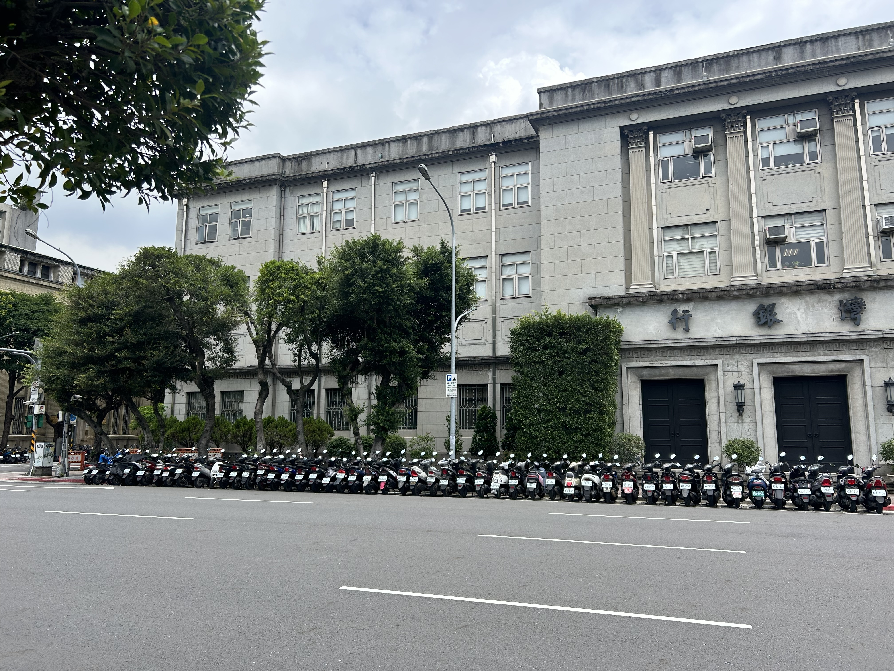
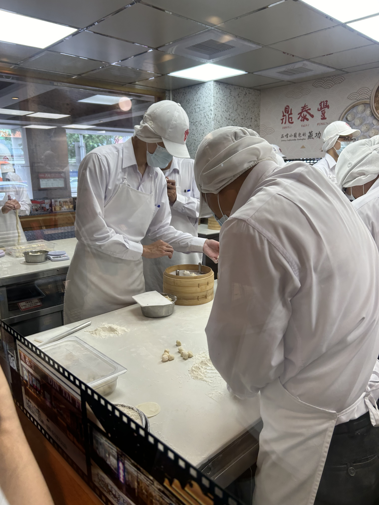
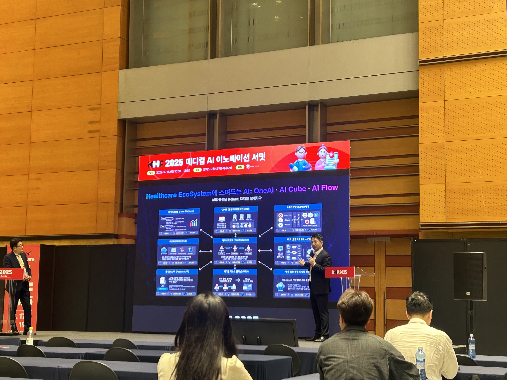
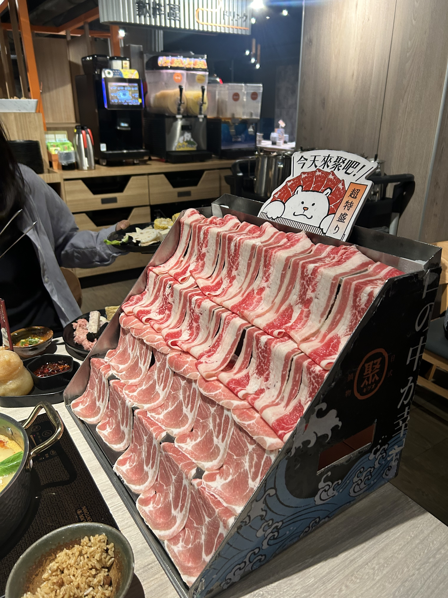

## 문제 1

Q: 다음 이미지에 대한 설명 중 옳지 않은 것은 무엇인가요?
- (1) 건물 앞에 많은 오토바이가 주차되어 있습니다.
- (2) 건물의 외관은 회색 톤으로 되어 있습니다.
- (3) 나무가 건물 앞에 여러 그루 심어져 있습니다.
- (4) 건물 앞에 사람들이 줄 서 있습니다.

Listening: Which of the following descriptions of the image is incorrect?
- (1) There are many motorcycles parked in front of the building.
- (2) The exterior of the building is in gray tones.
- (3) There are several trees planted in front of the building.
- (4) People are lined up in front of the building.

정답: (4) 건물 앞에 사람들이 줄 서 있지 않습니다.

---------------------

## 문제 2

Q: 다음 이미지에 대한 설명 중 옳지 않은 것은 무엇인가요?
- (1) 요리사들이 모자를 쓰고 있습니다.
- (2) 사람들은 만두를 빚고 있는 중입니다.
- (3) 가게 안의 사람들은 모두 검은색 옷을 입고 있습니다.
- (4) 작업대 위에는 밀가루가 놓여 있습니다.

Listening: Which of the following descriptions of the image is incorrect?
- (1) The chefs are wearing hats.
- (2) The people are making dumplings.
- (3) Everyone inside the store is wearing black.
- (4) There is flour on the work table.

정답: (3) 가게 안의 사람들은 흰색 옷을 입고 있습니다.

---------------------

## 문제 3

Q: 다음 이미지에 대한 설명 중 옳지 않은 것은 무엇인가요?
- (1) 발표자가 무대에서 프레젠테이션을 진행하고 있습니다.
- (2) 무대 옆에 커다란 화면이 설치되어 있습니다.
- (3) 사람들이 식사를 하고 있는 모습이 보입니다.
- (4) '2025 메디컬 AI 이노베이션'이라는 문구가 보입니다.

Listening: Which of the following descriptions of the image is incorrect?
- (1) A presenter is giving a presentation on stage.
- (2) There is a large screen set up next to the stage.
- (3) People are seen having a meal.
- (4) The phrase '2025 Medical AI Innovation' is visible.

정답: (3) 사람들이 식사를 하고 있는 모습이 아니라 발표를 듣는 모습이 보입니다.

---------------------

## 문제 4

Q: 다음 이미지에 대한 설명 중 옳지 않은 것은 무엇인가요?
- (1) 고기가 계단식으로 진열되어 있습니다.
- (2) 배경에 음료 기계들이 보입니다.
- (3) 한 사람이 음식을 담고 있는 모습이 있습니다.
- (4) 식탁에 김치가 놓여 있습니다.

Listening: Which of the following descriptions of the image is incorrect?
- (1) The meat is displayed in a stepped manner.
- (2) There are drink machines visible in the background.
- (3) A person is seen holding a plate of food.
- (4) Kimchi is placed on the table.

정답: (4) 식탁에 김치가 아닌 다른 음식들이 놓여 있습니다.

---------------------

